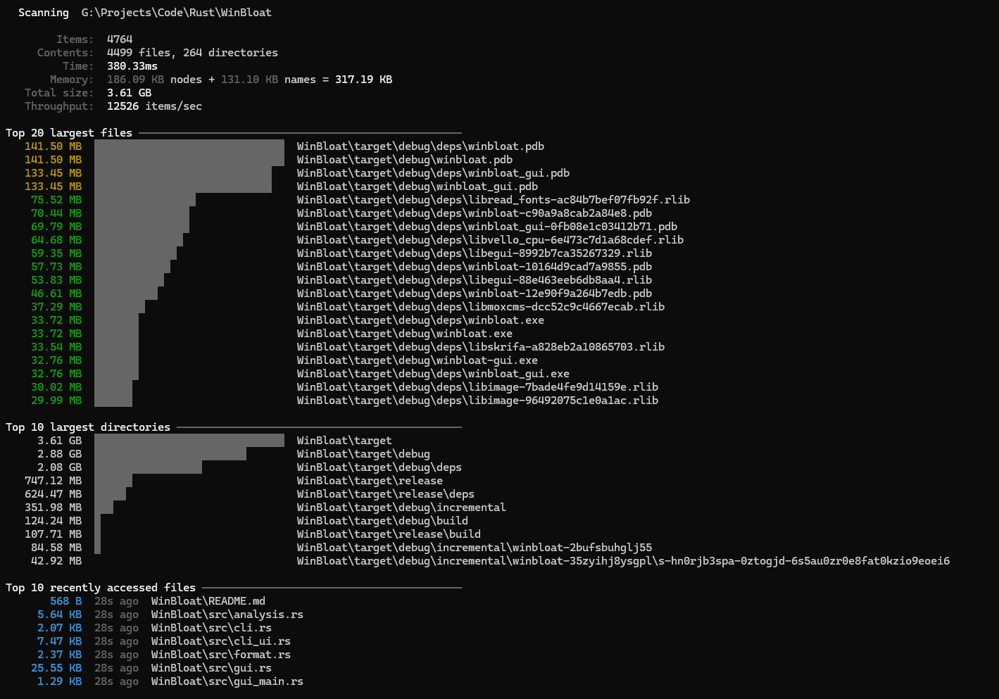
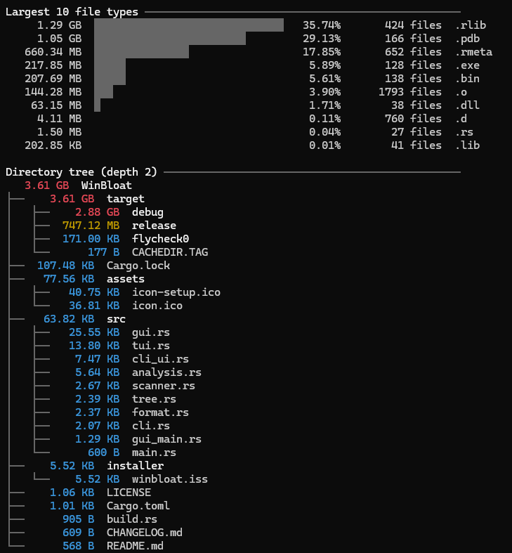

<p align="center">
  
</p>

# WinBloat

WinBloat focuses on the CLI. The GUI is an experimental extra and is not actively developed.

Read-only disk usage scanner for Windows. Browse a directory tree, find large files and folders, and see size totals by file type.

```text
winbloat [PATH]                # CLI report
winbloat --mode tui [PATH]     # Terminal interface
winbloat --mode gui [PATH]     # Window with tree, details, and treemap
```

<p align="center">
  
  
</p>

Sizes are logical file sizes; allocated disk space and filesystem attributes are not collected.

Licensed under the [MIT License](LICENSE).
